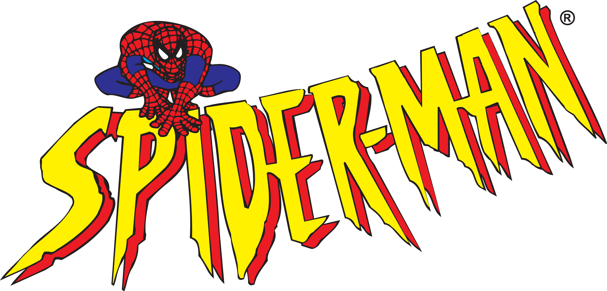
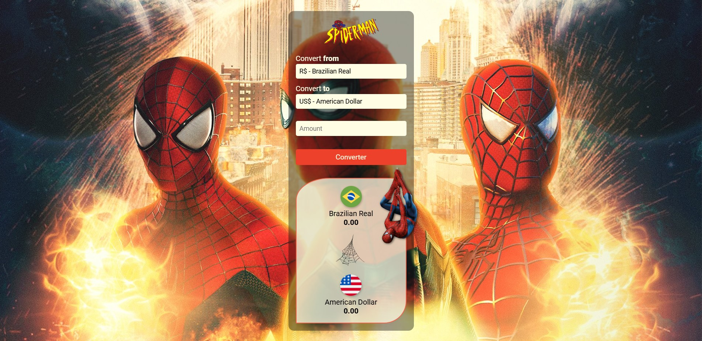

<!-- Logo -->
<div align=center>
  
</div>

<h1 align=center>
<!-- Title -->
  Currency Converter - Spider-Man Theme 🕸️
</h1>

<!--- "Welcome!" badges and "Made by..." -->
<div width=auto height=auto align=center>
  
  
  
</div>
<br>

<!--- Index with reference links -->
<p align="center">
 <a href="#technologies">Technologies</a> • 
 <a href="#about">About the Project</a> • 
 <a href="#clone">Clone</a> •
 <a href="#acknowledgments">Acknowledgments</a>
</p>

<!--- Short description of the project -->
<p align="center">
    <b>This project was developed as part of a challenge from the DevClub course. It’s a currency converter with a theme inspired by Spider-Man.
The converter allows you to convert values from Brazilian Real (BRL) to other currencies. Note that it only converts from BRL to other currencies, not the reverse.<b/>
</p>

<!-- Project link -->
<p align="center">
     <a href="https://gustavo-santos-dev.github.io/SpidermanCurrencyConverter-JavaScript-CSS-HTML5/">📱 View the Project</a>
</p>
<br>

<!-- Project images -->
<h2 id="layout">🎨 Project Preview</h2>
<p align="center">
    
</p>
<br>

<!---About the Project -->
<h2 id="about">🚀 About the Project</h2>
<p>The goal of this project was to apply HTML, CSS, and JavaScript skills to create a functional and visually appealing currency converter themed around Spider-Man. 
The interface is simple and easy to use, allowing users to enter a value in BRL and select a target currency to see the converted value. 
Important: the entered value must be a whole number, without dots, commas, or any other separators (e.g., for "fifty thousand," enter 50000).<p/>
<br>
<br>

<!-- Technologies Used -->
<h2 width="3" id="tec">💻 Technologies Used</h2>


<br>
<br>

- HTML5: Semantic structure to enhance accessibility and SEO, optimizing search engine indexing.
- CSS: Advanced styling that provides an attractive and responsive design, tailored to the Spider-Man theme.
- JavaScript: Adds interactivity and performs currency conversions, enabling a dynamic and functional experience.
<br>
<br>

<!-- Prerequisites -->
<h3>⚙️ Prerequisites</h3>

Before getting started, ensure you have the following tools installed:

- [Visual Studio Code](https://code.visualstudio.com/download)
- [Git](https://git-scm.com/)

<br>

<h3 id="clone">📥 Cloning the Repository</h3>
<p>Follow the steps below to clone this project:<p>

<br>

1. Clone the Repository:
```bash
git clone https://github.com/Gustavo-Santos-Dev/SpidermanCurrencyConverter-JavaScript-CSS-HTML5.git
```

2. Enter the Project Directory
```bash
cd SpidermanCurrencyConverter-JavaScript-CSS-HTML5
```

<br>

<h2 id="acknowledgments">🤝 Acknowledgments</h2>

Special thanks to the DevClub course for the lessons on HTML, CSS, JavaScript, and GitHub, which were essential for the creation of this project.

<table>
  <tr>
    <td align="center">
      <a href="#">
        <br>
        <sub>
          <a href="https://www.linkedin.com/in/rodolfomori/">Rodolfo Mori</a>
        </sub>
      </a>
    </td>
  </tr>
</table>

<br>
<br>

<h2> 📄 LICENSE </h2>
This project is licensed under the MIT License. Feel free to use, modify, and distribute this code as needed.
See the <a href="">LICENSE</a> file for more details.

<br>


